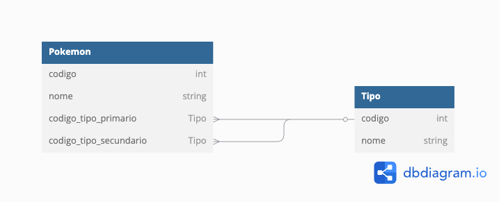

# Desafio Elevential

O desafio abaixo serve para avaliar os conhecimentos de frontend e backend do participante.

## Escopo
O seu cliente, Carvalho, é um catalogador de Pokémon. Ele precisa de um sistema para deixar mais fácil o cadastro de novas espécies que ele vem encontrando em suas pesquisas, de forma simples e rápida, através de um sistema web.
Carvalho já tem uma lista com 150 desses Pokémons, e o sistema deve vir com esses Pokémons pré-cadastrados.
[Esses dados podem ser encontrados aqui](./dados_iniciais.json)

Cada Pokémon terá as seguintes informações:
1. Código
2. Nome
3. Tipo
4. Tipo secundário
   1. Campo opcional

Cada tipo terá as seguintes informações:
1. Código
2. Nome

## Requisitos
1. Forma de cadastrar, listar, editar e deletar Pokémons, conforme a descrição do que precisa ser salvo em um Pokémon
2. Forma de cadastrar, listar, editar e deletar tipos
3. Criação dos Pokémons que Carvalho tem, disponibilizados [aqui](./dados_iniciais.json)
4. Listagem com filtros de nome e tipo
5. Repositório no github com o código
6. Descrição no readme do repositório, ensinando como rodar na máquina localmente o seu sistema

Caso não seja possível finalizar tudo, você pode enviar o que conseguiu finalizar!

## Opcionais
1. Vídeo mostrando o uso do sistema no Youtube, no readme do repositório
2. Hospedagem na internet
3. Containerização do sistema

## Tecnologia Utilizada

O desafio pode ser realizado com qualquer tecnologia de preferência do participante.

Caso não tenha nenhuma em mente, recomendações possíveis são:
1. Python -> Django
2. Python -> Django + React
3. Node.js -> Mongo, Express, React("MERN")
4. C# -> DOTNET + React
5. Ruby -> Ruby on Rails

## Esboço do Banco de Dados

# Exemplo básico funcional
## [Um exemplo do que é esperado pode ser encontrado aqui](https://desafio-pokedex.elevential.com/)
